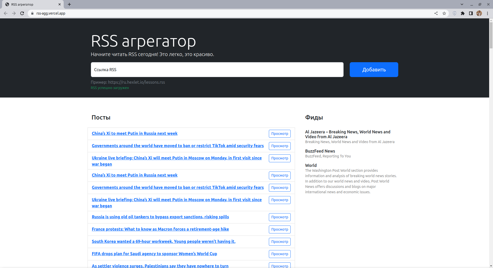
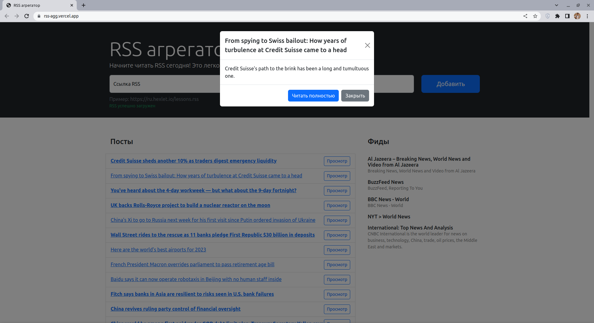

  

# RSS-aggregator
Hello! My name is Andrey Gulyaykin and this is my third **frontend** project on [Hexlet](https://ru.hexlet.io/pages/about).

## Description:
As part of the project, it was necessary to implement the RSS aggregator service.

RSS aggregator is a service for aggregating RSS feeds, with the help of which it is convenient to read a variety of sources, for example, blogs.

It allows you to add an unlimited number of sources (on the right), updates them itself and adds new entries to the general stream (on the left).

This service is able to request RSS feeds of sites for the presence of new posts and display them in a convenient way, as well as mark what you read.
## Installation:

Clone this repository on your machine in the project directory.

`git clone git@github.com:andrew-walker91/frontend-project-11.git`

`make install`

`make build`

## How to use:
 - Insert a valid RSS link into the input field.
 - Click the "Add" button.
 - A list of sources will appear on the right, and a list of posts on the left.
 - Click on the "View" button to preview the description.
 - Posts are updated automatically in real time.

## Demonstration:  
### Main page:
\

### Modal with preview:
\

# Click [here](https://rss-agg.vercel.app/) to view in the browser

